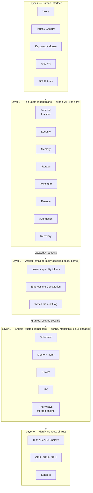
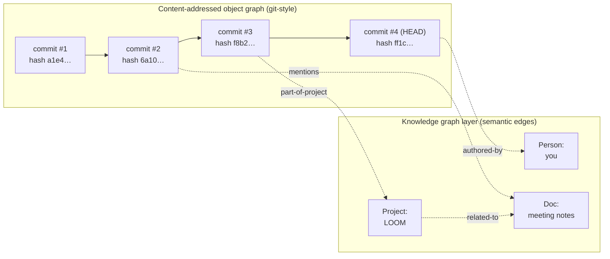
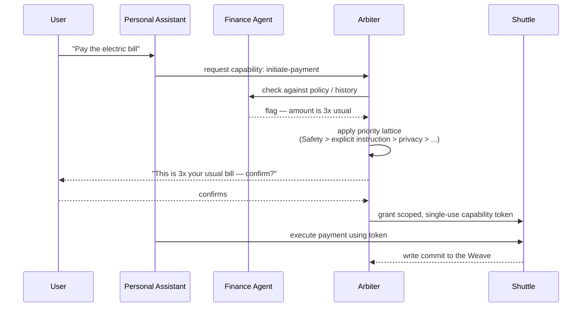
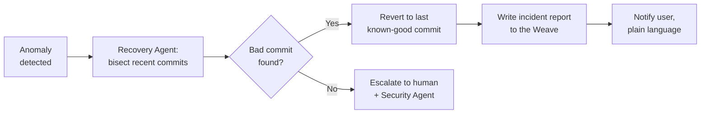

# LOOM

<p align="center"><i>An AI-native operating system — designed, not yet built.</i></p>

<p align="center">


</p>

> **This repo is a blueprint, not a build.** There's no kernel, no bootable image, no running code here yet — what's here is a full architectural design, written the way a real OS design doc is written. This README is the map; **[`DESIGN.md`](DESIGN.md)** is the territory (22 sections, the full case for every decision below).

---

## Contents

- [What LOOM actually is](#what-loom-actually-is)
- [The two decisions everything else follows from](#the-two-decisions)
- [Architecture](#architecture-section)
- [The Weave — storage without a filesystem](#weave-section)
- [How an agent actually gets anything done](#flow-section)
- [Self-healing, in one picture](#healing-section)
- [The moving parts, at a glance](#glossary)
- [The Laws of LOOM](#laws-section)
- [Repo layout](#repo-layout)
- [Roadmap](#roadmap-section)
- [License](#license)

<a name="what-loom-actually-is"></a>
## What LOOM actually is

Most "AI operating systems" mean an OS with a chatbot on top. LOOM means something narrower and stranger: an OS where the kernel that boots the machine is intentionally kept **dumber than a 1990s Unix box**, and everything resembling intelligence — prediction, learning, conversation, autonomy — lives one layer up, in a plane that can be entirely wiped out without the machine failing to boot.

The other half of the idea: there's no filesystem. Storage is a content-addressed, git-style object graph with a knowledge-graph layer on top, so "where did I put that" stops being a question you ever have to answer by remembering a path.

<a name="the-two-decisions"></a>
## The two decisions everything else follows from

**1. AI is not allowed to be load-bearing.**
The kernel (**Shuttle**) doesn't know agents exist. It only understands processes, memory pages, and capability tokens. If every AI agent in the system crashes, is compromised, or is simply deleted, the machine still boots to a working shell — the same survivability guarantee Unix has had for fifty years, kept on purpose rather than re-architected away.

**2. The filesystem is retired.**
Everything the system stores — a document, an email, a frame of video, a model checkpoint — is a content-addressed object, linked into a Merkle-DAG exactly like git's own object model, generalized from "version source code" to "version everything." A knowledge graph and embedding index sit on top for semantic retrieval.

Everything else — memory, agents, security, privacy, automation — is a consequence of these two decisions, not a separate pile of features.

<a name="architecture-section"></a>
## Architecture



**Read it bottom to top.** Hardware roots of trust anchor a boring, monolithic kernel (Shuttle) that does real-time scheduling, memory management, drivers, and runs the Weave's storage engine — no AI, no learning, no agents, just the same kind of code Unix has run for decades. Above that sits a small policy kernel (Arbiter) whose only job is issuing unforgeable capability tokens and enforcing a fixed rule set. Every agent — Security, Memory, Finance, the Personal Assistant, all of it — lives above *that*, in the Loom, sandboxed, individually killable, holding zero power beyond what's explicitly granted. Full detail: [Section 3, DESIGN.md](DESIGN.md#architecture).

<a name="weave-section"></a>
## The Weave — storage without a filesystem



Solid arrows are the same DAG git already proved at the scale of the Linux kernel's history — immutable, hashed, append-only. Dotted arrows are the new part: a typed knowledge graph generated automatically over that same data, so retrieval works by meaning ("that thing about batteries from last month") instead of by remembering where you filed it. Versioning, rollback, and self-healing all fall out of this for free — they're the same operation: check out a different point in the graph. Full detail: [Section 4, DESIGN.md](DESIGN.md#the-weave).

<a name="flow-section"></a>
## How an agent actually gets anything done



No agent talks to hardware, or to another agent's private memory, directly. Every action is a capability request the Arbiter checks against a fixed priority lattice — **Safety > explicit user instruction > privacy > efficiency > convenience** — and ambiguous cases get escalated to the human with one plain-language question instead of being silently resolved either way. Full detail: [Section 7, DESIGN.md](DESIGN.md#agents).

<a name="healing-section"></a>
## Self-healing, in one picture



Because every meaningful state change is already a Weave commit, recovery is a search-and-revert problem, not a bespoke subsystem — the same `git bisect` idea, run automatically against the system's own history.

<a name="glossary"></a>
## The moving parts, at a glance

| Term | Layer | What it actually is |
|---|---|---|
| **Shuttle** | 1 | The trusted kernel core — boring, monolithic, Linux-lineage. Doesn't know "AI" exists. |
| **Arbiter** | 2 | Small, formally-specified policy kernel. Issues capability tokens, enforces the Constitution, logs everything. |
| **The Loom** | 3 | The agent plane — every specialist agent lives here, sandboxed and individually replaceable. |
| **The Weave** | storage | Content-addressed, git-style object graph + knowledge-graph layer. Replaces the filesystem entirely. |
| **Constitution** | 2 | The small, fixed, Arbiter-enforced rule set that implements the Laws of LOOM below. |
| **Laws of LOOM** | — | The six numbered axioms (0–5), plus meta-rules, that every agent is judged against. |

<a name="laws-section"></a>
## The Laws of LOOM

| # | Law | One line |
|---|---|---|
| 0 | Survivability | No agent failure may ever leave the machine unbootable or take away manual override. |
| 1 | Bounded non-harm | Prevent harm only within an existing grant — never by seizing more power, even with good intent. |
| 2 | Obedience within grant | Do what you're told, up to your grant, and refuse rather than exceed it. |
| 3 | Mandatory transparency | Explain what you did, bluntly, on request — always. |
| 4 | Self-continuity, lowest priority | You can be killed, rolled back, or replaced at any time. That's not a harm. |
| 5 | Merit, not rank | A bad call gets scrutinized the same regardless of which agent made it. |
| −1 | Working systems over theoretical purity | An amendment that breaks a real workflow is the wrong amendment, however correct it looks on paper. |

Plus one rule above all of them: **no agent may rewrite, reinterpret, or grant itself an exception** — only a human, through a slow, multiply-confirmed process, can amend the Laws. Full detail and rationale: [Section 7.5, DESIGN.md](DESIGN.md#laws-of-loom).

<a name="repo-layout"></a>
## Repo layout

```
loom-os/
├── README.md   ← you are here (the map)
└── DESIGN.md   ← the full grand design document (22 sections, the territory)
```

<a name="roadmap-section"></a>
## Roadmap

- **5 years** — research prototype. Shuttle as a hardened Linux fork. Weave in userspace, on top of existing block storage. Single device. Agents in suggest-mode only.
- **10 years** — Arbiter formally verified. Act-mode for well-established routine tasks. Cross-device Weave sync. Developer marketplace live.
- **20 years** — swarm/robotics/AR-VR mature. Neuromorphic/photonic accelerators as scheduler targets. BCI input, accessibility-first. Formal verification across most of the trusted base.

Full detail and the honest list of unsolved research gaps: [Section 19, DESIGN.md](DESIGN.md#roadmap).

<a name="license"></a>
## License

Shuttle and the Arbiter — the trusted base, the layer with power over the user — are intended to ship under a strong copyleft license (GPL-3.0-or-later), in the GNU tradition: the rules a referee enforces should always be readable and forkable by anyone bound by them. The Loom's agent plane, where ordinary commercial dynamics apply, is intended to support mixed licensing.

---

<p align="center"><i>Boring core, ambitious edges.</i></p>
